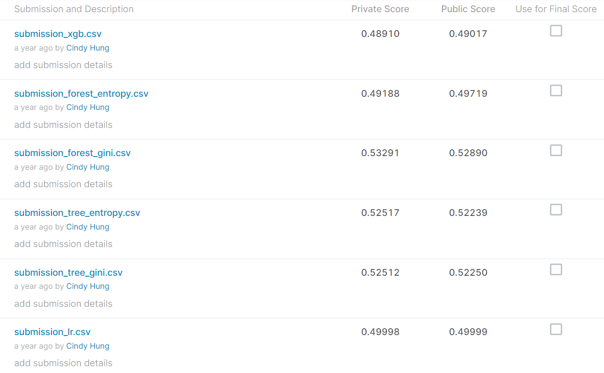

# :musical_note: WSDM - KKBox's Music Recommendation Challenge
> * **課程名稱：**【BDM41302】機器學習導論 INTRODUCTION TO MACHINE LEARNING
> * **指導老師：** **_李佳蓉 老師_**
---
> * 競賽題目：  
> [WSDM - KKBox's Music Recommendation Challenge（KKBOX歌曲推薦系統）](https://reurl.cc/Kpg2Zp)
> * 題目目標：  
> 預測用戶在一段時間內觸發第一個可觀察到的收聽事件後重複播放歌曲的機會。(Predict the chances of a user listening to a song repetitively after the first observable listening event within a time window was triggered.)
> * 完整期末報告：[ML-final report-KKBOX](05153255_ML_WSDM-KKBox'sMusicRecommendationChallenge.pdf)
> * 完整程式檔(ipynb)：[ML-KKBOX-final_code](05153255_ML_KKBox_FinalReport.ipynb)
> * 提交分數(submission score)：
>   
> 
> * 心得與結論：  
> 　　由於時間緊迫，加上第一次做Kaggle競賽，且由於是獨自完成，故幾乎從頭開始研究、觀察，亦詢問很多人，才慢慢建立自己的架構和想法，雖然很多內容都是仿照許多參考資料才得以有想法，但自己獨立完成完整的程式碼，真的很感動，也很辛苦，在程式資齡不到1年的情況下，雖然可能提交成績的結果並不好，但我已經很滿足了，也學到很多東西。
> * 未來改善：  
>   * 針對模型進行選擇並調整參數  
> 　　由於模型執行時間甚久，所以沒有機會可以調適參數，加上一直想用參數選擇來最佳化模型，希望以後有機會可以做到。
>   * 嘗試使用不同的模型，例如：SVM  
> 　　嘗試不同的情況下使用不同的建模法，應該將資料的情境和特性再次劃分，並以不同情境去適用不同演算法，而非將所有資料套到同一個演算法，也許會有不錯的效果。
